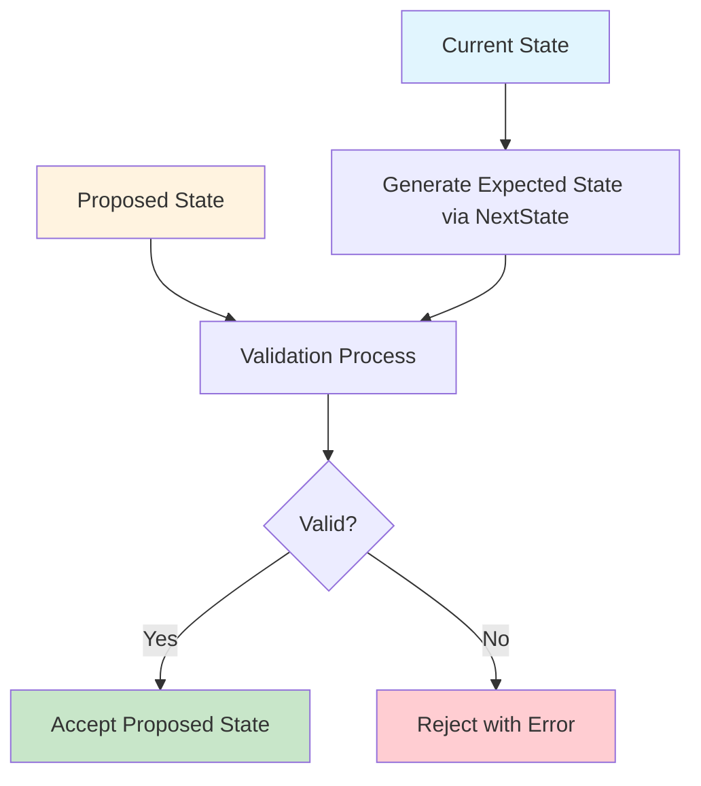
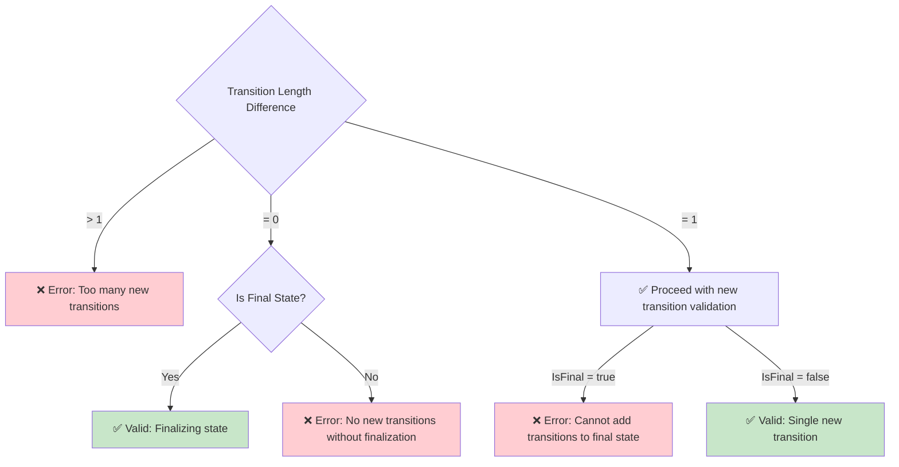
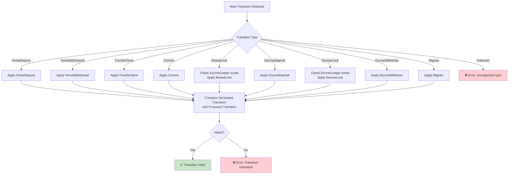
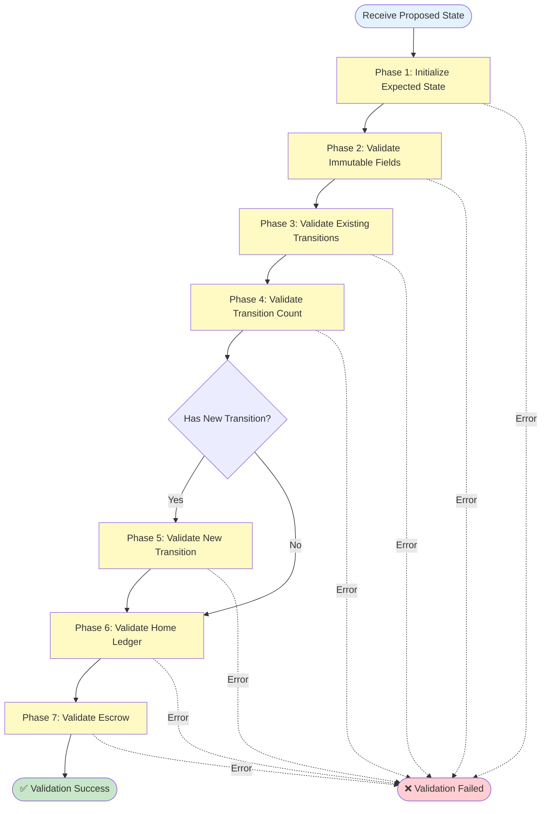

# State Advancement Validation (StateAdvancerV1)

## Overview

The `StateAdvancerV1.ValidateAdvancement()` function is responsible for validating that a user-proposed state is a valid advancement from their current state. This is a critical security mechanism that ensures state transitions follow the protocol rules and maintain consistency.

**Location**: `pkg/core/advancer.go:18-173`

**Purpose**: Verify that a proposed state correctly evolves from the current state by:
1. Reconstructing what the expected next state should be
2. Comparing the proposed state against the expected state
3. Validating that ledger balances are correctly updated
4. Ensuring signatures and channel IDs are present and valid

## High-Level Process



## Validation Phases

The validation process is organized into 7 distinct phases:

### Phase 1: Initialize Expected State (Lines 19-32)

```go
expectedState := currentState.NextState()
if proposedState.HomeChannelID == nil {
    return fmt.Errorf("home channel ID cannot be nil")
}

if expectedState.HomeChannelID == nil {
    expectedState.HomeChannelID = proposedState.HomeChannelID
    expectedState.HomeLedger.BlockchainID = proposedState.HomeLedger.BlockchainID
    expectedState.HomeLedger.TokenAddress = proposedState.HomeLedger.TokenAddress
}
```

**What happens**:
- Generate the expected next state from the current state
- Ensure the proposed state has a home channel ID
- For first-time channel creation, copy channel metadata from proposed state to expected state

**Why**: The first state after channel creation needs to establish the home channel ID and ledger metadata.

### Phase 2: Validate Immutable Fields (Lines 30-61)

Validates that core identifiers remain unchanged:

| Field | Rule | Line |
|-------|------|------|
| `HomeChannelID` | Must match expected | 30-32 |
| `Version` | Must increment correctly | 35-37 |
| `UserWallet` | Must not change | 40-42 |
| `Asset` | Must not change | 45-47 |
| `Epoch` | Must match expected | 50-52 |
| `ID` | Must match deterministic calculation | 55-57 |
| `UserSig` | Must be present | 59-61 |

**Why**: These fields define the state's identity and must follow strict rules to prevent tampering.

### Phase 3: Validate Existing Transitions (Lines 63-74)

```go
transitionLenDiff := len(proposedState.Transitions) - len(expectedState.Transitions)
if transitionLenDiff < 0 {
    return fmt.Errorf("proposed state is missing transitions")
}
for i := range expectedState.Transitions {
    expectedTransition := expectedState.Transitions[i]
    proposedTransition := proposedState.Transitions[i]

    if err := expectedTransition.Equal(proposedTransition); err != nil {
        return fmt.Errorf("unexpected transition at index %d: %w", i, err)
    }
}
```

**What happens**:
- Calculate how many new transitions are in the proposed state
- Verify all existing transitions match exactly

**Why**: Transitions are immutable once added to a state. This prevents historical revision.

### Phase 4: Validate Transition Count Rules (Lines 76-89)



**Rules**:
1. At most one new transition per state advancement
2. If no new transitions, the state must be marked as final
3. Cannot add transitions to a final state

**Why**: These rules maintain atomicity and finality guarantees.

### Phase 5: Validate New Transition (Lines 86-136)

This is the most complex phase, validating the single new transition if present.



**Process**:
1. Extract the new (last) transition from proposed state
2. Apply the same transition type to expected state using the transition's parameters
3. Compare the generated transition with the proposed transition
4. They must match exactly (type, txID, accountID, amount)

**Why**: This validates that the transition was correctly computed according to protocol rules.

**Special Cases**:
- `MutualLock` and `EscrowLock`: Require checking that `EscrowLedger` exists in the proposed state and passing blockchain metadata
- These transitions create escrow channels with specific blockchain and token parameters

### Phase 6: Validate Home Ledger (Lines 138-143)

```go
if err := proposedState.HomeLedger.Equal(expectedState.HomeLedger); err != nil {
    return fmt.Errorf("home ledger mismatch: %w", err)
}
if err := proposedState.HomeLedger.Validate(); err != nil {
    return fmt.Errorf("invalid home ledger: %w", err)
}
```

**Validations**:
1. **Equality Check**: All ledger fields must match expected values:
   - `TokenAddress`
   - `BlockchainID`
   - `UserBalance`
   - `UserNetFlow`
   - `NodeBalance`
   - `NodeNetFlow`

2. **Ledger Validity Check**:
   - Token address must be non-empty
   - Blockchain ID must be non-zero
   - User balance cannot be negative
   - Node balance cannot be negative
   - Sum of balances must equal sum of net flows: `UserBalance + NodeBalance = UserNetFlow + NodeNetFlow`

**Why**: The home ledger tracks the primary channel balances and must maintain conservation of value.

### Phase 7: Validate Escrow Channel & Ledger (Lines 145-170)

```go
if (expectedState.EscrowChannelID == nil) != (proposedState.EscrowChannelID == nil) {
    return fmt.Errorf("escrow channel ID presence mismatch")
}

if expectedState.EscrowChannelID != nil && proposedState.EscrowChannelID != nil {
    if *expectedState.EscrowChannelID != *proposedState.EscrowChannelID {
        return fmt.Errorf("escrow channel ID mismatch: expected=%s, proposed=%s",
            *expectedState.EscrowChannelID, *proposedState.EscrowChannelID)
    }
}
```

**Validations**:
1. **Escrow Channel ID**:
   - Presence must match (both nil or both non-nil)
   - If present, values must match exactly

2. **Escrow Ledger**:
   - Presence must match expected state
   - If present, all fields must match expected values
   - Must pass validation (same rules as home ledger)
   - **Critical Rule**: Escrow blockchain ID must differ from home blockchain ID

**Why**: Escrow channels enable cross-chain operations. The blockchain ID constraint ensures the escrow is truly on a different chain.

## Complete Validation Flow



## Key Design Principles

### 1. **Deterministic Validation**
The expected state is computed deterministically from the current state. If the proposed state matches this computation, it's valid.

### 2. **Immutability of History**
Past transitions cannot be modified. All existing transitions must match exactly.

### 3. **Atomic State Changes**
Only one new transition can be added per state advancement. This maintains clear causality.

### 4. **Conservation of Value**
Ledger validation ensures that the sum of balances equals the sum of net flows, maintaining conservation of value.

### 5. **Cross-Chain Safety**
Escrow channels must be on different blockchains than home channels, enforced by blockchain ID comparison.

## Example Scenarios

### Scenario 1: Valid Home Deposit

```
Current State (v1):
  - HomeChannelID: 0xABC...
  - HomeLedger: {UserBalance: 100, NodeBalance: 0}
  - Transitions: []

Proposed State (v2):
  - HomeChannelID: 0xABC...
  - HomeLedger: {UserBalance: 200, NodeBalance: 0, UserNetFlow: 200}
  - Transitions: [HomeDeposit{Amount: 100}]
  - UserSig: 0x123...

Result: ✅ VALID
- Version incremented correctly (1 → 2)
- Single new transition added
- Ledger balances updated correctly
- User signature present
```

### Scenario 2: Invalid - Too Many Transitions

```
Current State (v1):
  - Transitions: []

Proposed State (v2):
  - Transitions: [HomeDeposit{...}, TransferSend{...}]

Result: ❌ INVALID
- Error: "proposed state contains more than one new transition"
- Only one transition allowed per advancement
```

### Scenario 3: Valid Mutual Lock (Escrow Creation)

```
Current State (v1):
  - HomeChannelID: 0xABC...
  - HomeLedger: {BlockchainID: 1, UserBalance: 500, NodeBalance: 0}
  - EscrowChannelID: nil
  - EscrowLedger: nil

Proposed State (v2):
  - HomeChannelID: 0xABC...
  - HomeLedger: {BlockchainID: 1, UserBalance: 500, NodeBalance: 100}
  - EscrowChannelID: 0xDEF...
  - EscrowLedger: {BlockchainID: 2, UserBalance: 100, NodeBalance: 0}
  - Transitions: [MutualLock{Amount: 100}]

Result: ✅ VALID
- Escrow channel created
- Escrow blockchain ID (2) differs from home blockchain ID (1)
- Ledger balances conserved
```

### Scenario 4: Invalid - Missing Signature

```
Proposed State:
  - UserSig: nil

Result: ❌ INVALID
- Error: "user signature is required"
- All proposed states must be signed by the user
```

### Scenario 5: Invalid - Ledger Imbalance

```
Proposed State:
  - HomeLedger: {UserBalance: 100, NodeBalance: 50,
                 UserNetFlow: 200, NodeNetFlow: 0}

Result: ❌ INVALID
- Error: "ledger balances do not match net flows"
- UserBalance + NodeBalance = 150
- UserNetFlow + NodeNetFlow = 200
- Conservation violated: 150 ≠ 200
```

## Security Considerations

1. **Replay Protection**: State ID incorporates wallet, asset, epoch, and version, preventing replays
2. **Signature Requirement**: All proposed states must be user-signed
3. **Monotonic Version**: Version must increment, preventing rollback attacks
4. **Balance Conservation**: Ledger validation prevents value creation or destruction
5. **Transition Immutability**: Past history cannot be rewritten
6. **Channel Binding**: Home channel ID cannot change once set

## Related Components

- **`State.NextState()`**: Generates the base for the next state (pkg/core/types.go:104-149)
- **`State.Apply*Transition()`**: Methods that apply specific transitions and return the created transition (pkg/core/types.go:170-397)
- **`Ledger.Validate()`**: Validates ledger balance conservation (pkg/core/types.go:431-451)
- **`Transition.Equal()`**: Compares two transitions for exact equality (pkg/core/types.go:740-754)

## Summary

The `ValidateAdvancement` function implements a comprehensive, multi-phase validation system that ensures:

1. ✅ State identity and metadata are preserved
2. ✅ Transitions follow protocol rules
3. ✅ Balances are correctly computed
4. ✅ Signatures are present
5. ✅ Cross-chain operations are properly constrained
6. ✅ Value conservation is maintained

This validation is the cornerstone of the state channel security model, preventing invalid state transitions while allowing legitimate operations to proceed.
