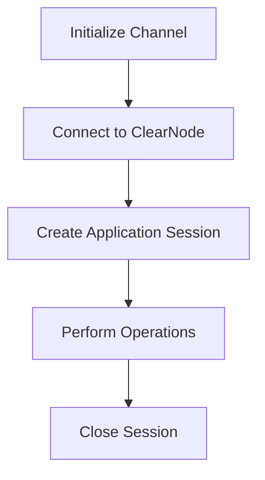

# Nitrolite SDK (V1)

[](https://www.npmjs.com/package/@erc7824/nitrolite)
[](https://github.com/erc7824/nitrolite/blob/main/LICENSE)
[](https://erc7824.org/quick_start)

A TypeScript SDK for building scalable blockchain applications using ERC-7824. The SDK provides both on-chain contract interactions and off-chain RPC communication with Clearnode.

> **⚠️ V1 Breaking Changes**: This is a major version update with significant API changes from v0.x. See the [migration guide](#migration-from-v0x) below.

## Documentation

- [Complete Documentation](https://erc7824.org/quick_start) - Full Documentation
- [Client Module](./src/client/README.md) - On-chain contract interactions
- [RPC Module](./src/rpc/README.md) - Off-chain Clearnode communication
- [Utilities](./UTILITIES.md) - Low-level utility functions

## SDK Modules

The Nitrolite SDK is organized into specialized modules:

### Client Module
On-chain contract interactions for channel lifecycle management.
- **NitroliteClient**: High-level API with automatic signing
- **NitroliteService**: Direct contract interactions
- **NitroliteTransactionPreparer**: Low-level transaction preparation

[Client Documentation](./src/client/README.md)

### RPC Module
Off-chain WebSocket communication with Clearnode.
- Session key management
- Channel operations
- Application sessions
- Real-time events

[RPC Documentation](./src/rpc/README.md)

### Utilities
Toolkit of pure functions for common operations:
- Amount formatting/parsing
- State packing/hashing/verification
- Channel ID calculation
- Contract data parsing

[Utilities Documentation](./UTILITIES.md)

## Features

- **Instant Finality**: Transactions settle immediately between parties
- **Reduced Gas Costs**: Most interactions happen off-chain, with minimal on-chain footprint
- **High Throughput**: Support for thousands of transactions per second
- **Security Guarantees**: Same security as on-chain, with cryptographic proofs
- **Framework Agnostic**: Works with any JavaScript framework (Vue, Angular, React, etc.)

## Installation

```bash
npm install @erc7824/nitrolite
```

## Quick Start

**[Nitrolite](https://www.npmjs.com/package/@erc7824/nitrolite)** is our official SDK for creating high-performance decentralized applications. It provides a comprehensive set of functions and types to establish WebSocket connections with ClearNode and manage application sessions.

## Prerequisites

Before you begin working with Nitrolite, ensure that you have:

- **Node.js**: Version 16 or later
- **Package Manager**: npm, yarn, or pnpm
- **Development Environment**:
    - For frontend: React, Vue, or similar framework
    - For backend: Node.js environment
- **Channel Setup**: Create a channel from your account at [apps.yellow.com](https://apps.yellow.com)

## ClearNode WebSocket

**ClearNode WebSocket URL**: `wss://clearnet.yellow.com/ws`

## Build with AI

We have generated a [llms-full.txt](https://erc7824.org/llms-full.txt) file that converts all our documentation into a single markdown document following the https://llmstxt.org/ standard.

## Complete Workflow



## Next steps

Building applications with Nitrolite involves these key steps:

1. **[Channel Creation](https://erc7824.org/quick_start/initializing_channel)**: Create a channel from your account at apps.yellow.com
2. **[ClearNode Connection](https://erc7824.org/quick_start/connect_to_the_clearnode)**: Establish WebSocket connection for off-chain messaging
3. **[Application Sessions](https://erc7824.org/quick_start/application_session)**: Create sessions to run specific applications
4. **[Session Closure](https://erc7824.org/quick_start/close_session)**: Properly close application sessions when finished

We recommend working through these guides in sequence to understand the complete application workflow. Each guide builds on concepts from previous sections.

Start with the [Channel Creation](https://erc7824.org/quick_start/initializing_channel) guide to begin your journey with Nitrolite applications.

## Migration from V0.x

V1 introduces significant improvements but includes breaking changes. Key differences:

### Client API Changes

**Channel Creation:**
```typescript
// V0
await client.depositAndCreate(user, node, asset, userDeposit, nodeDeposit);

// V1
await client.depositAndCreateChannel(node, token, amount, {
    definition: { challengeDuration, user, node, nonce, metadata },
    state: initialState,
    counterpartySig: nodeSig,
});
```

**Balance Queries:**
```typescript
// V0
await client.getChannelBalance(channelId);

// V1
await client.getAccountBalance(nodeAddress, tokenAddress);
```

### Removed Methods

- `joinChannel()` - Channels are created directly
- `depositAndCreate()` - Replaced with `depositAndCreateChannel()`
- `resizeChannel()` - Use state transitions
- `getChannelBalance()` - Use `getAccountBalance()`

### New Concepts

- **Channel Definitions with Nonces**: Unique channel identification
- **Ledger-Based States**: Separate home/non-home state tracking
- **Vault Management**: Per-node, per-token balance tracking
- **State Intent**: Challenge/Final state specification

[Full Migration Guide](./src/client/README.md#migration-guide)

### RPC Changes

The RPC protocol now uses a flat array format:

```typescript
// V0
{ req: [requestId, method, params, timestamp], sig: ["0x..."] }

// V1
[RPCMessageType, requestId, method, params, timestamp]
```

[RPC Breaking Changes](./src/rpc/README.md#breaking-changes-from-v05x)

## Documentation

For complete documentation, visit [https://erc7824.org](https://erc7824.org)

## Examples

### On-Chain: Create Channel

```typescript
import { NitroliteClient, generateChannelNonce } from '@erc7824/nitrolite';
import { parseEther, zeroAddress } from 'viem';

// Initialize client (see Client documentation for full setup)
const client = new NitroliteClient(config);

// Generate unique nonce
const nonce = generateChannelNonce(userAddress);

// Deposit and create channel
const tx = await client.depositAndCreateChannel(
    nodeAddress,
    zeroAddress, // ETH
    parseEther('1.0'),
    {
        definition: {
            challengeDuration: 3600,
            user: userAddress,
            node: nodeAddress,
            nonce,
            metadata: '0x0000000000000000000000000000000000000000000000000000000000000000',
        },
        state: {
            version: 0n,
            intent: 0,
            metadata: '0x0000000000000000000000000000000000000000000000000000000000000000',
            homeState: {
                chainId: 1n,
                token: zeroAddress,
                decimals: 18,
                userAllocation: parseEther('1.0'),
                userNetFlow: 0n,
                nodeAllocation: 0n,
                nodeNetFlow: 0n,
            },
            nonHomeState: { /* ... */ },
        },
        counterpartySig: nodeSig,
    }
);

console.log('Channel created:', tx);
```

### Off-Chain: Submit State via RPC

```typescript
import { createSubmitStateMessage } from '@erc7824/nitrolite/rpc';

// Create WebSocket connection
const ws = new WebSocket('wss://clearnet.yellow.com/ws');

// Submit state update
const message = await createSubmitStateMessage(signer, {
    id: stateId,
    transitions: [...],
    asset: 'usdc',
    userWallet: account.address,
    epoch: 1,
    version: 2,
    homeLedger: { /* ... */ },
    // ... other state fields
});

ws.send(message);
```

### Utilities: Amount Conversion

```typescript
import { formatTokenAmount, parseTokenAmount } from '@erc7824/nitrolite';

// Convert bigint to human-readable
const readable = formatTokenAmount(1500000000000000000n, 18);
console.log(readable); // "1.5"

// Convert string to bigint
const amount = parseTokenAmount("1.5", 18);
console.log(amount); // 1500000000000000000n
```

## Contributing

Contributions are welcome! Please feel free to submit a Pull Request.

## License

This project is licensed under the MIT License - see the LICENSE file for details.
